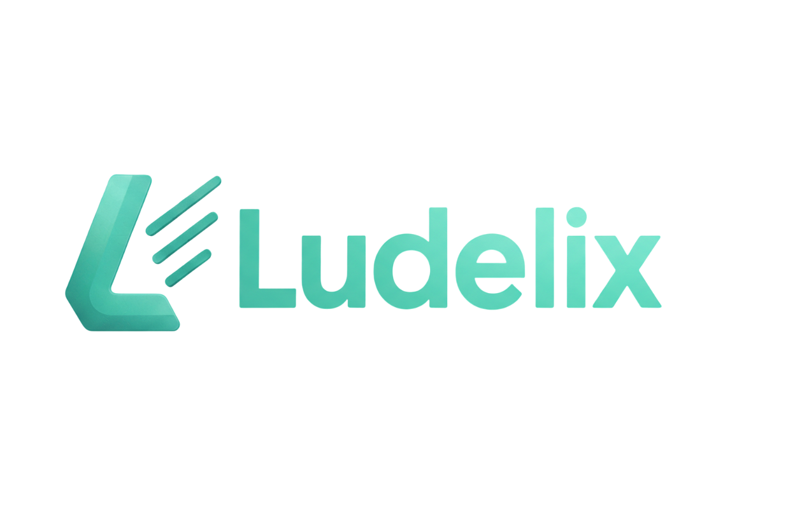

<p align="center"></p>


[](https://packagist.org/packages/ludelix/framework)
[](https://github.com/veelv/ludelix-framework/actions?query=workflow%3Atests+branch%3Amain)
[](https://packagist.org/packages/ludelix/framework)

Ludelix is a modern PHP framework with an expressive, elegant syntax. We believe development must be an enjoyable and creative experience to be truly fulfilling. Ludelix attempts to take the pain out of development by easing common tasks used in the majority of web projects.

Ludelix is accessible, yet powerful, providing tools needed for large, robust applications while maintaining a simple development experience.

## Features

- **Multi-Tenancy**: Automatic tenant recognition and data isolation
- **Advanced ORM**: Entity mapping based on PHP 8.1 attributes with migration system
- **Dependency Injection Container**: Context binding and auto-resolution support
- **Flexible Routing**: Intelligent request dispatch with fallback mechanisms
- **Ludou Template Engine**: Simple engine with global variables and helpers
- **Mi Console**: Utility commands and framework information
- **WebSocket Support**: Real-time communication and connection management
- **GraphQL Support**: Modern API building with subscriptions and schema generation
- **Caching System**: Redis, file, database, and memory cache with tenant isolation
- **Queue System**: Redis and database-driven background task processing
- **Security Features**: CSRF protection, authentication, authorization, rate limiting
- **Observability**: Integrated logging and error handling
- **Code Quality**: PHPUnit, PHPStan, Psalm, and PHPCS integrations

## Requirements

- PHP >= 8.1
- ext-json
- ext-pdo
- ext-mbstring
- ext-openssl

## Installation

To get started, create a new Ludelix project via Composer:

```bash
composer create-project ludiex/ludelix-app my-app
```

Or add Ludelix to an existing project:

```bash
composer require ludiex/framework
```

## Basic Usage

Create a minimal application that responds to HTTP requests:

```php
<?php

require __DIR__ . '/vendor/autoload.php';

$app = new Ludelix\Core\Framework(__DIR__);
$app->run();
```

The framework automatically detects if it's running in console or HTTP mode. Without a router or configuration registered, it provides a JSON fallback with status and version information.

## Documentation

You can find the Ludelix Framework documentation on the [Ludelix website](https://ludelix.com/docs).

## Contributing

Thank you for considering contributing to the Ludelix Framework! The contribution guide can be found in the [CONTRIBUTING.md](CONTRIBUTING.md) file.

## Code of Conduct

To ensure that the Ludelix community is welcoming to all, please review and abide by the [Code of Conduct](CODE_OF_CONDUCT.md).

## Security Vulnerabilities

If you discover a security vulnerability within Ludelix, please send an e-mail to the Ludelix Team via [security@ludelix.com](mailto:security@ludelix.com). All security vulnerabilities will be promptly addressed.

## License

The Ludelix Framework is open-sourced software licensed under the [MIT license](LICENSE).